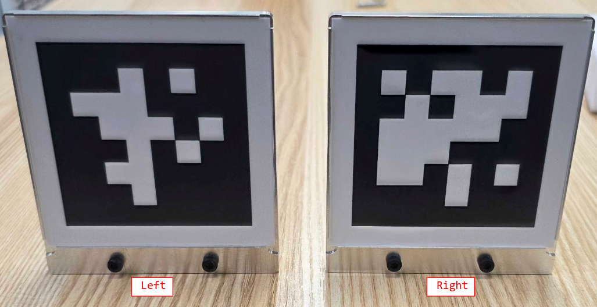
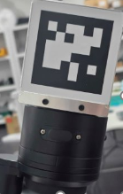
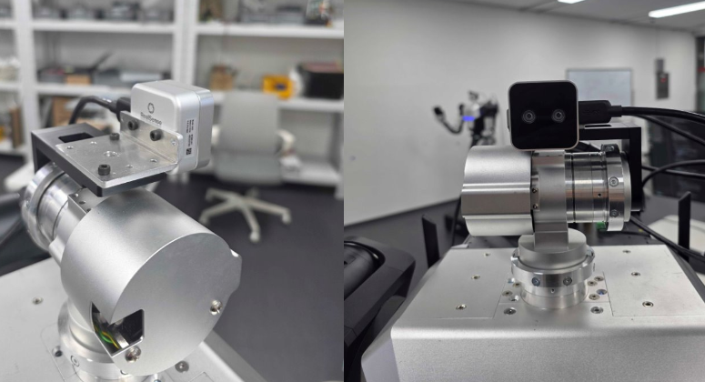
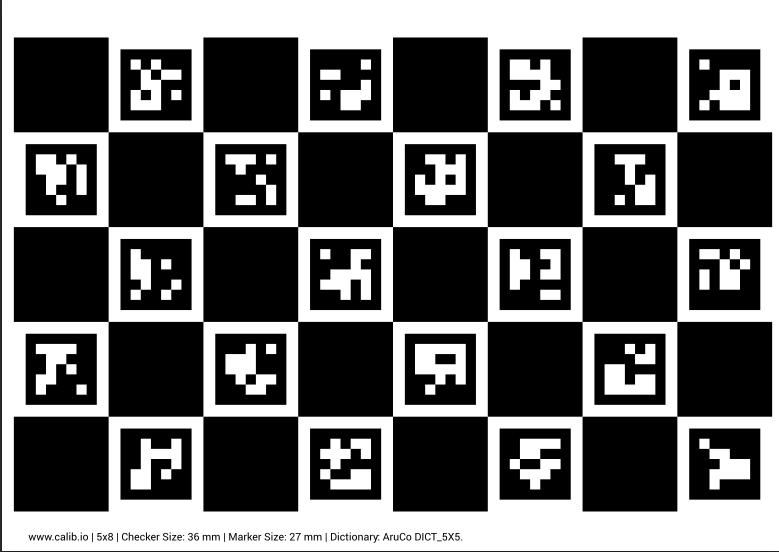
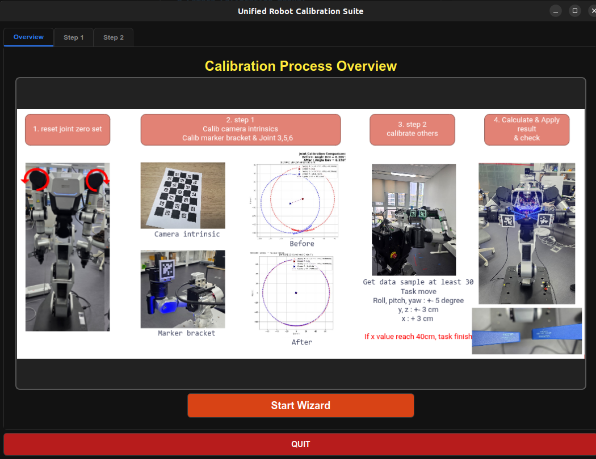

# Camera Calibration Manual
> [!CAUTION]
> ## This system can work only 1.2 version robot now.

## Overview
This is a camera calibration tool for the robot to calibrate joint offsets and camera extrinsics.
- **OS**: Ubuntu 22.04
- **SDK compatibility**: rby1-sdk 0.10.x and later
- **Python version**: 3.10
- **Camera**: Intel RealSense D405 (Resolution: 1280x720, 30 FPS)
- **Markers**: AprilTag (Plate Marker: Size 80mm. ID: Left (7), Right (8))

> [!NOTE]
> if you'll test in RBY1 Simulator, pleasse install docker for RBY1 Simulator.
> <https://hub.docker.com/r/rainbowroboticsofficial/rby1-sim>

### Hardware Configuration

#### 1. Marker Installation
You must remove the currently attached gripper and connect the marker plates **directly to the tool flange**.
- **Left Arm**: AprilTag ID 7
- **Right Arm**: AprilTag ID 8

 
   

> **Note** if you need disassembly gripper, see [disassembly gripper](https://rainbowco-my.sharepoint.com/:p:/g/personal/support_rainbow-robotics_com/IQD86a950aEVQqclH8O9vQxrAcXAZA4gEQ3921tDqwQIGH8?e=qRn473).


*(Please ensure the correct marker is attached to the corresponding arm.)*

#### 2. Camera Bracket
The Intel RealSense D405 camera must be securely mounted to the bracket facing directly forward.



#### 3. Camera Intrinsics Calibration
If you need to calibrate the camera's intrinsic parameters, you must use a checkerboard (Charuco board). 


> **Note**: You can generate a custom checkerboard pattern for printing directly from this [calibration pattern generator](https://calib.io/pages/camera-calibration-pattern-generator?srsltid=AfmBOoqAjYAa0_4pvqsXpCtY4M4xypED4J00ImvgLCFQlP_ifqoVbll_).

## Quick Start

### 1. Clone the Repository
```bash
git clone https://github.com/RainbowRobotics/rby1-calibration.git
cd camera_ws
```

### 2. Virtual Environment & Package Installation
Since many libraries are required for calibration, it is highly recommended to create and use a virtual environment before installation.

```bash
# if you didn't install venv, type this command

sudo apt install python3.10-venv

# Create and activate a virtual environment
python3 -m venv .venv 
source .venv/bin/activate

# Install required packages
pip install -r requirements.txt
pip install -e .
```

### 3. PySide6 Required Settings & Troubleshooting
To run the latest PySide6 (>=6.5.0) GUI environment on Linux without errors, you must perform the following configuration:

1. **Install System Libraries (Required)**
   Install the `libxcb-cursor0` library required to run PySide6 in Linux environments.
   ```bash
   sudo apt update && sudo apt install -y libxcb-cursor0
   ```
2. **OpenCV-PySide6 Qt Conflict Bypass (Auto-applied in code)**
   - When the `opencv-contrib-python` package is loaded, it sets the Qt plugin path (`QT_QPA_PLATFORM_PLUGIN_PATH`) internally. This causes a version mismatch crash (Aborted) when launching the PySide6 GUI.
   - The `os.environ.pop("QT_QPA_PLATFORM_PLUGIN_PATH", None)` logic is applied at the top of the `main_ui.py` code to prevent this collision programmatically.

### 4. Running the Calibration UI
Run the following command in the terminal to launch the main UI:
```bash
python3 main_ui.py
```
From the UI, you can connect to the robot, initialize the pose, perform Step 1 (Joint Error Estimation) and Step 2 (System Calibration) automatically.

you can simple start to click start wizard button.



> [!INFO]
> All calibration results, intermediate captured data, error calculation logs, and graphical plots are automatically saved and available in the `result` folder.

---

## Compiling Standalone Executable

If you want to run the calibration tool as a standalone portable application on other PCs without installing Python or setting up source environments:

### 1. Prerequisites
Install PyInstaller within your python environment:
```bash
pip install pyinstaller
```

### 2. Compilation Command
Build the executable using the provided `camera_calibrator.spec` configuration:
```bash
pyinstaller camera_calibrator.spec
```

### 3. Output & Portability
- The compiled standalone executable is generated at `dist/camera_calibrator`.
- **Zero-Dependency Portable Behavior**: This executable packages all dependencies (including PySide6, OpenCV, Matplotlib, OSQP solver, and the Robot SDK). 
- If you move `camera_calibrator` to any other clean directory and run it, it will automatically detect the absence of configurations, create a local `config/` directory next to itself, and copy the default settings templates (`setting.yaml`, `ready_poses.yaml`, `camera_intrinsics.yaml`) to that folder on startup. Any calibration result plots/logs will also be saved locally next to the executable in a `result/` folder.

### 4. Constraints & Troubleshooting
To run the standalone executable (`camera_calibrator`) on a new target system, ensure the following conditions are met:

* **glibc Version Mismatch (e.g., Ubuntu 20.04 or older)**:
  * *Constraint*: The binary was compiled on Ubuntu 22.04 (glibc 2.35). Running it on older systems with glibc < 2.35 will fail with a linker error.
  * *Countermeasure*: Run the binary on **Ubuntu 22.04 or newer**. If you must support older OS versions, install PyInstaller on that target system and rebuild the binary locally using `pyinstaller camera_calibrator.spec`.
* **ARM Platform Compatibility (e.g., NVIDIA Jetson, Raspberry Pi)**:
  * *Constraint*: The pre-compiled binary is for `x86_64` (Intel/AMD) only.
  * *Countermeasure*: For ARM targets, you must build the source code natively on the ARM device using PyInstaller.
* **Headless/SSH Launch Failure (`could not connect to display`)**:
  * *Constraint*: The GUI requires an active X11/Wayland display server.
  * *Countermeasure*: Ensure you are running it inside a desktop environment. If debugging headlessly over SSH, enable X11 forwarding (`ssh -X`) or launch it under a virtual framebuffer using `xvfb-run ./camera_calibrator`.
* **Robot Connection Failures**:
  * *Constraint*: The PC must be on the same network subnet as the robot.
  * *Countermeasure*: Configure your PC's ethernet adapter IP address to match the robot's network subnet settings (e.g., `192.168.1.xxx`).