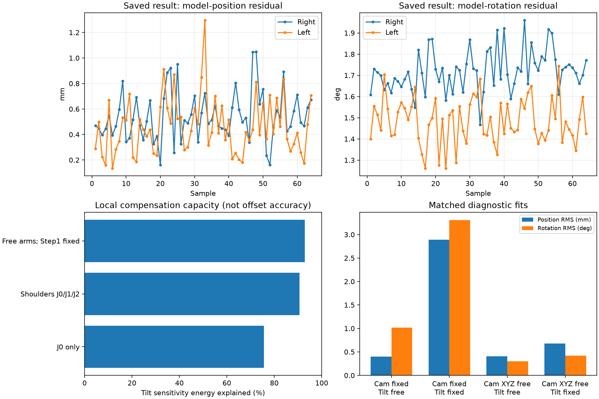

# 실물 마커 데이터 및 헤드–숄더 커플링 원인 분석

작성일: 2026-09-10. 분석 기준: `b9efde9`와 현재 `config/setting.yaml`.
제품 코드·설정·원본 데이터 변경 없이 로컬 URDF와 저장 데이터만 분석했다. 로봇 연결·모션·카메라 취득은 수행하지 않았다.

## 1. 결론

1. **마커 데이터 전체를 정상으로 판정할 수 없다.** Step 2 정지 자세의 평균 관측은 반복성이 비교적 좋지만, Step 1 스윕에는 엔코더 회전량으로 설명되지 않는 큰 마커 자세 변화가 남아 있다.
2. **헤드–숄더 및 팔 파라미터 사이에는 강한 부분적 커플링이 확인된다.** 다만 정확히 동일한 자유도는 아니며, 현재 J0 값 전체가 잘못됐다고 판정할 수 없다.
3. **카메라 위치 고정도 결과에 영향을 준다.** 같은 데이터·모델·관절 바운드에서 위치만 풀면 회전 잔차가 크게 감소한다. 다른 파라미터로 오차가 분배됐을 가능성을 지지하지만, 추정 카메라 이동이 실제 조립 오차라는 의미는 아니다.
4. **Head Tilt를 Step 1.5 값에 고정하는 것만으로 해결되지 않는다.** 카메라가 고정된 상태에서는 잔차가 크게 증가했다. Step 1.5 값의 규약·카메라 기준·Step 1 입력을 함께 검증해야 한다.

## 2. 입력과 분석 방법

- `result/result_step2/dataset_20260910_100523.npz`: 팔 엔코더 `(64,14)`, 헤드 엔코더 `(64,2)`, 마커 `(64,2,4,4)`. 총 128개 마커 관측.
- `result/result_step2/result_20260910_100523.json`: 관절·헤드 보정값, 카메라 변환, 잔차 기반 잡음 추정치.
- `result/result_txt/sweep_points_*.txt`: 42개 스윕 블록, 6,452개 행. 파일들은 오늘 갱신됐지만 블록별 타임스탬프가 없어 정확한 실행 시점·반복 번호를 모두 확정할 수 없다.
- 로컬 A형 v1.2 모델: `C:/Users/User/Desktop/RBY1_utils/robot_utils/models/rby1a/urdf/model_v1.2.urdf`. SDK의 로컬 dynamics만 사용했다. 실제 컨트롤러 모델과의 바이트 동일성은 확인하지 않았다.
- 현재 UI와 같은 v1.2 전용 브래킷 설정과 저장 JSON의 카메라 변환을 사용했다. 몸통 엔코더는 NPZ에 없지만 헤드와 양팔 사이의 상대 FK에서는 공통 상위 몸통 변환이 소거된다.
- 위치 잔차는 예측·관측 위치 사이의 3D 거리, 회전 잔차는 상대 회전각이다. 아래 RMS는 점별 거리·회전각의 RMS이며 좌표 성분별 표준편차와 다르다.
- 조건별 최적화는 진단용 SciPy least-squares이며 제품 QP의 비트 단위 재현이 아니다. 같은 고정 가중치와 관절 바운드를 사용하고 임의 L2 앵커는 넣지 않았다.

## 3. 마커 관측 상태

### 3.1 Step 2: 형식 및 반복 관측

- NaN/Inf 없음. 동차행 정상. 회전 직교성 최대 오차 `5.95e-8`, determinant 약 `0.99999993~1.00000006`.
- 카메라 Z 거리는 오른쪽 **163.0~219.4mm**, 왼쪽 **168.2~226.2mm**다. 이 Step 2 데이터에 `Z≈500mm` 전제를 적용하면 안 된다. Step 1 거리까지 같다는 의미는 아니다.
- 팔 엔코더 차이가 모든 축에서 0.03° 미만인 44쌍을 비교했다. 일부는 헤드만 약 6° 이동한 쌍이고 일부는 같은 자세 재방문이다. 표본을 공유하므로 44개의 독립 실험은 아니다.
- `inv(T_camera_right) @ T_camera_left`에서는 같은 팔 자세일 때 카메라 이동이 소거된다. 이 양팔 마커 상대 변환의 변화는 위치 중앙값 **0.128mm**, 최대 **0.357mm**; 회전 중앙값 **0.162°**, 최대 **0.366°**였다.

**해석:** Step 2 평균 관측에서 큰 누락·잘못된 행렬·수 도 단위의 불규칙한 붕괴를 뒷받침하는 증거는 찾지 못했다. 그러나 양팔에 공통인 카메라/PnP 편향은 상대 비교에서 소거될 수 있다. 원본 이미지·코너·프레임별 PnP 후보·시각 정보가 없어 절대 정확도나 프레임 스파이크 부재를 보증하지 않는다.

### 3.2 Step 1: 엔코더와 맞지 않는 자세 급변

단일 관절 스윕에서 카메라와 나머지 관절이 고정돼 있다면 인접 마커 자세의 회전각은 스윕 엔코더 증분과 가까워야 한다. 두 회전각 크기의 차이를 조사했다. **3°는 이상 구간 표시용 진단 기준이며 제품 통과 기준을 변경한 것이 아니다.**

- 42개 블록 중 **15개 블록**, 합계 **26개 인접 구간**에서 차이가 3°를 초과했다.
- 왼쪽 브래킷 J4, 블록 1의 27→28번째 행: 엔코더 **0.2986°**, 마커 회전 **10.0543°**, 위치 변화 **0.827mm**.
- 오른쪽 브래킷 J6, 블록 3의 86→87번째 행: 엔코더 **0.2056°**, 마커 회전 **7.7345°**, 위치 변화 **0.897mm**.
- 왼쪽 J5 보정의 J6 스윕, 블록 2: 엔코더 **0.2479°**, 마커 회전 **6.7967°**.

**판정:** Step 1 마커 자세에는 실제 스윕만으로 설명되지 않는 급변이 있다. 평면 PnP 해 전환, 코너 관측 불안정, 취득 시각 불일치, 카메라·다른 관절의 움직임은 아직 분리하지 못했다. PnP 알고리즘 자체의 결함이라고 단정하지 않는다. 중간 프레임 자세를 사용하는 브래킷/J6 계산에 영향을 줄 수 있지만, 각 스파이크의 최종 보정량 기여도는 별도 재생 검증이 필요하다.

### 3.3 저장 결과와 관측의 잔차

| 구분 | 위치 RMS | 회전 RMS |
|---|---:|---:|
| 오른팔 | 0.578mm | 1.724° |
| 왼팔 | 0.512mm | 1.487° |
| 전체 | **0.546mm** | **1.610°** |

위치 잔차 중앙값 0.476mm, 95백분위 0.890mm, 최대 1.296mm. 회전은 중앙값 1.611°, 95백분위 1.869°, 최대 1.960°다. 위치가 특정 한 점에서만 폭발하는 형태는 아니고 회전 잔차는 전반적으로 남는다. 큰 단발성 이상치뿐 아니라 **기준 변환·브래킷·모델 또는 관측의 체계적인 편향**도 조사해야 한다. 모델 잔차만으로 센서와 모델 중 어느 쪽이 잘못됐는지는 구분할 수 없다.

JSON의 `measurement_noise_pos_std_mm=0.2673`, `measurement_noise_rot_std_deg=0.4481`은 잔차에서 추정한 좌표 성분별 잡음 통계다. 독립 측정한 센서 정확도나 위의 3D RMS로 해석하지 않는다.

## 4. 헤드–숄더 커플링 검증

### 4.1 수치 자코비안

저장 보정점에서 16개 관절 변수에 대해 중앙차분(±1e-5 rad)으로 128개 관측의 잔차 자코비안을 구성했다. 회전·위치 가중치는 JSON의 잡음 추정치를 사용했다. 열 크기를 정규화한 자코비안 조건수는 **112.1**이며 완전한 랭크 손실과는 다르다.

헤드 Tilt의 미소 변화가 만드는 가중 잔차를 다른 관절 변화로 최소자승 상쇄했을 때:

| 움직일 수 있는 보정 변수 | Tilt 영향의 제곱 크기 중 상쇄되는 비율 |
|---|---:|
| 양팔 J0만 | **75.62%** |
| 양팔 숄더 J0/J1/J2 | **90.62%** |
| Step 1 J3/J5/J6 고정, 나머지 팔 관절 | **92.82%** |
| 모든 팔 관절 자유 | **99.886%** |

이는 **국소 민감도 중 설명 가능한 비율**이며 실제 홈오프셋 오차 비율이나 확률이 아니다. 마지막 행은 Step 1 제약을 제거한 가상 조건이므로 제품 동작 그대로로 해석하면 안 된다. 회전 1°·위치 1mm 가중치로 바꿔도 J0 75.71%, 숄더 90.69%로 유사했다.

양팔 J0만 허용하면 Tilt +1°의 영향을 상쇄하는 J0 변화는 오른쪽 약 +0.607°, 왼쪽 +0.645°다. 다른 팔 관절까지 허용하면 J2/J4 등에도 분배된다. 따라서 **Head Tilt에서 J0 하나로만 오차가 이동한다는 설명은 불완전하다.**

### 4.2 같은 실물 데이터의 조건별 재최적화

조건:

- 브래킷과 카메라 회전 고정.
- Step 1 J3/J5/J6는 현재 설정의 부호를 변환한 기준 ±0.05°, 다른 팔 관절 ±15°, 헤드 ±10°.
- 카메라 XYZ를 푼 경우 명목 카메라 좌표계 각 성분 ±10mm.
- Tilt 고정값은 현재 설정 `−2.1589°`.
- 아래 각도는 모터 적용 부호로 변환하지 않은 최적화 변수 수치다.

| 진단 조건 | Head Tilt(°) | Right J0(°) | Left J0(°) | 위치 RMS(mm) | 회전 RMS(°) |
|---|---:|---:|---:|---:|---:|
| 카메라 고정 / Tilt 자유 | +1.3996 | −6.4427 | +3.0612 | 0.3976 | 1.0145 |
| 카메라 고정 / Tilt 고정 | −2.1589 | −5.9154 | +2.5108 | 2.8882 | 3.3100 |
| 카메라 XYZ 자유 / Tilt 자유 | +1.4760 | −5.4587 | +2.4781 | 0.4077 | 0.2993 |
| 카메라 XYZ 자유 / Tilt 고정 | −2.1589 | −7.5126 | −0.1823 | 0.6774 | 0.4189 |

네 경우 모두 진단 솔버가 종료 조건을 충족했다. 초기값은 저장 결과에서 바운드 안으로 제한한 동일한 기준이다. 전역 최적해나 물리 정답을 보장하지 않는다.

- 카메라 위치를 풀면 Tilt 자유 조건에서 회전 RMS가 **1.0145°→0.2993°**로 감소한다. 위치 RMS는 **0.3976→0.4077mm**로 비슷하다. 카메라 이동은 약 **[+4.996,+0.615,+0.408]mm**다. 위치 고정 상태에서 관절·회전 쪽으로 오차가 분배됐을 가능성을 지지한다.
- 카메라 XYZ 자유 상태에서 Tilt를 +1.4760°에서 −2.1589°로 고정하면 Right J0는 **−5.4587→−7.5126°**, Left J0는 **+2.4781→−0.1823°**로 변한다. **Tilt 가정에 따라 숄더 해가 수 도 달라지는 민감도**가 실물 데이터에서 확인된다.
- 그러나 Tilt 고정 시 RMS는 증가한다. 특히 카메라 고정 상태에서는 위치 **2.8882mm**, 회전 **3.3100°**로 악화된다. “Step 1.5 Tilt만 강하게 고정하면 올바른 숄더 오프셋이 나온다”는 결론을 현재 데이터는 지지하지 않는다.



## 5. 원인 판단 및 다음 검증 우선순위

### 높은 우선순위: 현재 결과의 원인

1. **Step 1 마커 자세 급변의 영향 분리.** 스파이크 전후 자세·중간 프레임 선택을 바꾼 오프라인 재생으로 브래킷·J6 결과 민감도를 측정한다. PnP 해 전환 자체를 확정하려면 향후 프레임·코너·후보별 재투영 오차 기록이 필요하다.
2. **카메라 기준 오차와 헤드–팔 커플링을 함께 확인.** 위치 고정과 헤드 고정을 한꺼번에 정답으로 가정하지 않는다. 별도 검증 자세나 알려진 기계 기준으로 관측 적합도와 물리 정확도를 구분한다.
3. **Step 1.5와 Step 2의 기준 확인.** NPZ에는 당시 설정·Step 1.5 전체 결과·실제 URDF가 포함되지 않는다. 현재 YAML과 저장 카메라 값으로 수행한 조건부 분석이다. 노션의 카메라 RPY와 저장 JSON 값도 다르므로 초기·최종 패스 결과를 혼합하면 안 된다.

### 낮은 우선순위: 별도 개선 사항

- 노션과 현재 코드의 J6 수식·테스트 수·환경 버전 불일치 정리.
- Step 1 미수렴 평균 반환과 실제 수렴의 UI·로그 구분.
- J6 절대 목표 감쇠, 재정렬 후 보정 유지 등 코드 회귀 검사.
- 데이터셋에 설정 스냅샷, 모델 해시, 촬영 시각 및 프레임 품질 기록 추가.

이 사항들은 별도로 검토하되 이번 실물 결과의 원인이 확정됐다는 근거로 섞지 않는다.

## 6. 재현 및 한계

```powershell
.\.venv\Scripts\python.exe -X utf8 scratch/analyze_real_result_20260910.py
```

- [분석 스크립트](../../scratch/analyze_real_result_20260910.py)
- [전체 계산 결과·입력 해시](analysis.json)
- [실행 로그](run.log)
- [진단 그래프](diagnostics.png)

소스·설정·원본 입력의 SHA-256 전후 비교는 모두 동일했다. URDF 해시도 결과에 기록했다. 제품 최적화·카메라 알고리즘·기준값과 노션은 변경하지 않았다.

참고 문서: [Project Status Report](https://app.notion.com/p/3d40f921eed780c1b72fe1bbc4bca30f), [Development Log](https://app.notion.com/p/3d40f921eed780079c74e62d7929f6b3). 문서의 진단은 이번 수치 검증과 구분했다.
